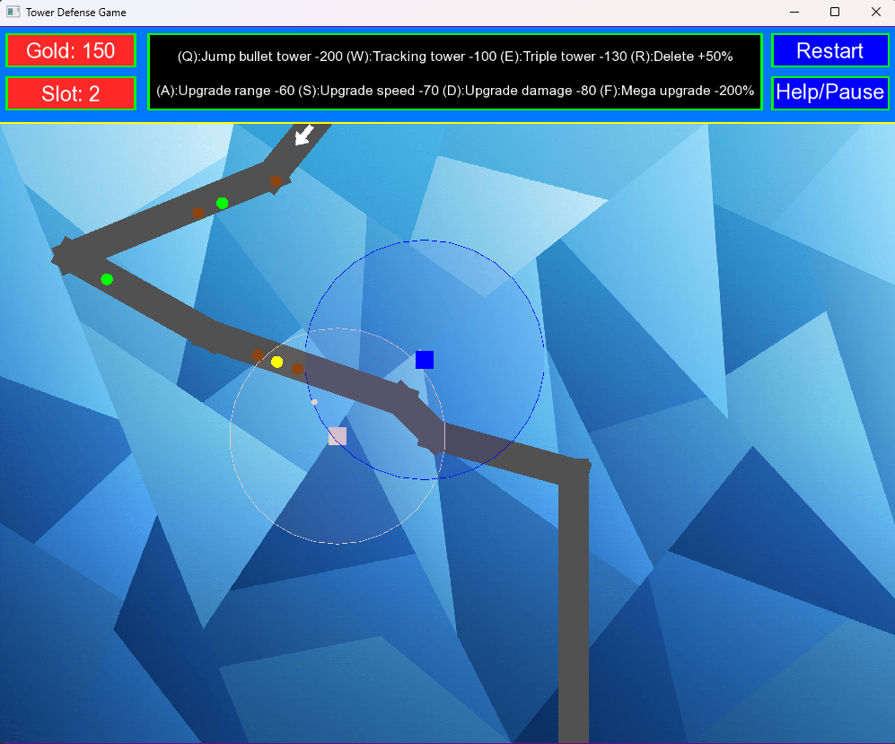

# **Tower Defense Game - C++**


## Table of Contents

- [Introduction](#introduction)
- [Key Techniques and Concepts](#Key-Techniques-and-Concepts)
- [Play or Build Instructions](#Play-or-Build-Instructions)
- [Contributing](#Contributing)

## **Introduction**
Tower Defense Game is a simple yet engaging game built with **C++** using the **SFML (Simple and Fast Multimedia Library)** for graphics rendering and event handling. The project is structured using modern C++ techniques, emphasizing clean code design and maintainability. It demonstrates concepts such as **Object-Oriented Programming (OOP)**, **Dependency Inversion Principle (DIP)**, **multithreading**, and **event handling**, **smart pointers (`std::unique_ptr`,...)**

   

## **Key Techniques and Concepts**
### **1. Object-Oriented Programming (OOP)**
- Classes such as `Tower` and `Enemy` encapsulate game logic and properties.
- Inheritance and polymorphism allow for easily extending functionality (e.g., different types of towers).

### **2. Dependency Inversion Principle (DIP)**
- High-level modules (e.g., game logic) depend on abstractions, not concrete implementations.
- Example: The `Enemy` and `Tower` classes interact through interfaces, making the game flexible for future extensions.

### **3. Memory Management with `std::unique_ptr`**
- Dynamic objects (e.g., towers and enemies) are managed using `std::unique_ptr`, ensuring:
  - No memory leaks.
  - Clear ownership semantics.
  - Automatic deallocation.

### **4. Multithreading**
- Background tasks like enemy movement and game state updates are handled in separate threads, ensuring smooth rendering and responsive gameplay.

### **5. Event Handling**
- SFML's event system is used to handle user inputs like:
  - Mouse clicks for placing towers.
  - Keyboard inputs for pausing or exiting the game.
  - ...

---

## **Play or Build Instructions**

### **Play**
1. Clone the repository:
   ```bash
   git clone https://github.com/OtaTran241/Tower_Defense_Game.git
   cd Tower_Defense_Game
   ```
   
2. Start the game by running the `tower_defense_game.exe` file in Release folder.
3. Game information and game instructions.
   1. `Tower information`: The tower will automatically shoot the nearest enemy (click on the tower to view its range).
      + `Tracking tower`: The tower shoot a bullet that tracks the enemy.
        - Mega upgrade: shoots 3 bullets that track the enemy.
      + `Triple tower`: The tower shoots 3 bullets in a straight line.
        - Mega upgrade: shoots 5 bullets in a straight line.
      + `Bullet Jump tower`: The tower shoots a bullet that jumps 2 more times to the nearest enemies.
        - Mega upgrade: the bullet jumps 4 more times to the nearest enemies.
   2. `Enemy information`: The enemy will follow the move path where they were spawned.
      + `Slow enemy`: The enemy is slow but has a lot of health. Drop: 50 gold
      + `Fast enemy`: The enemy is fast but has low health. Drop: 100 gold
      + `Clone enemy`: The enemy will split into 2 mini enemies when its health drops below 50. Drop: 200 gold   
3.3`Upgrade information`: Each tower can be upgraded a maximum of 5 times, once reaches the maximum, it can be upgraded to Mega.
  + `Upgrade range`: +30 range / 60 gold
  + `Upgrade damage`: +10 damage / 70 gold
  + `Upgrade attack speed`: -0.1 cool down / 80 gold
  + `Upgrade mega`: Special effect of the tower / 200% of the tower's gold  
3.4`Game information`: Game mechanics.
  + Starting or restarting the game will randomly select 1-3 move paths (Direction from top to bottom or left to right).
  + For each move path, you will receive 300 gold and 3 slots (you can click restart to choose your desired difficulty).
  + Kill enemies to earn gold.
  + For each number of enemies spawned, you will receive slot (the next slot is equal to the previous slot's number of enemies + 80%).
  + Placing a tower will consume the corresponding amount of gold and -1 slot.
  + Deleting a tower will add 50% of the corresponding gold and +1 slot.
  + When the enemy reaches the end of the path, you will lose an amount of gold equivalent to the gold dropped by that enemy.
  + If gold < 0, the game will automatically restart to begin a new round.

### **Build**
#### **Prerequisites**
- **Visual Studio** (or any C++17+ compatible IDE).
- **SFML Library**.

1. Clone the repository:
   ```bash
   git clone https://github.com/OtaTran241/Tower_Defense_Game.git
   cd Tower_Defense_Game
   ```
2. Open the project in **Visual Studio**.
3. Configure the project to use SFML:
   - Set **Additional Include Directories** to `SFML/include`.
   - Set **Additional Library Directories** to `SFML/lib`.
   - Add the necessary SFML `.lib` files to **Additional Dependencies**.
4. Build the project (preferably in `Release` mode).
5. Run the generated `.exe` file.

---

## Contributing
Contributions are welcome! If you have any ideas for improving the model or adding new features, feel free to submit a pull request or send an email to [tranducthuan220401@gmail.com](mailto:tranducthuan220401@gmail.com).
